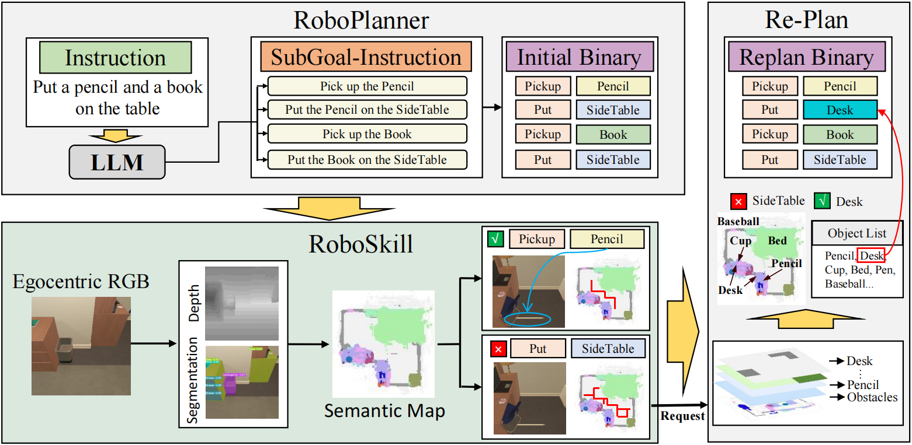
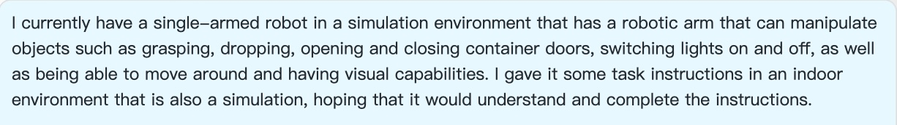
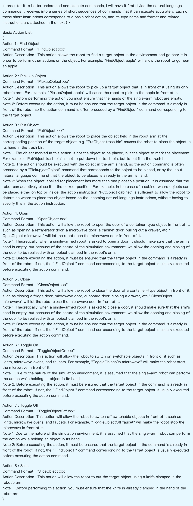
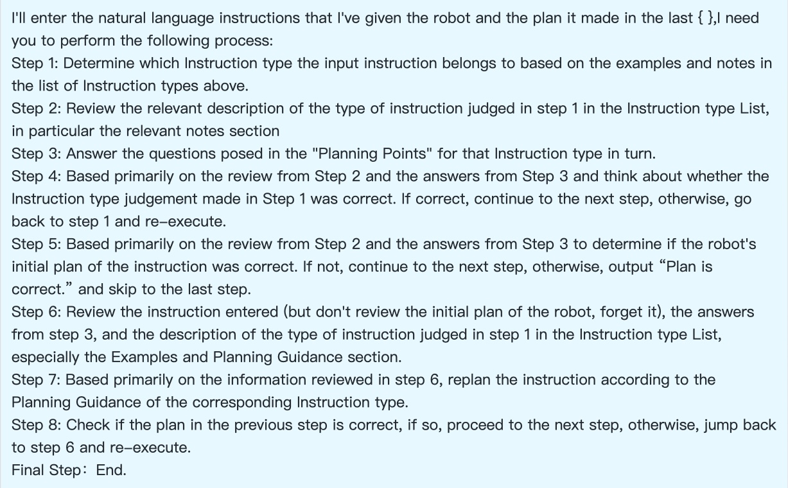
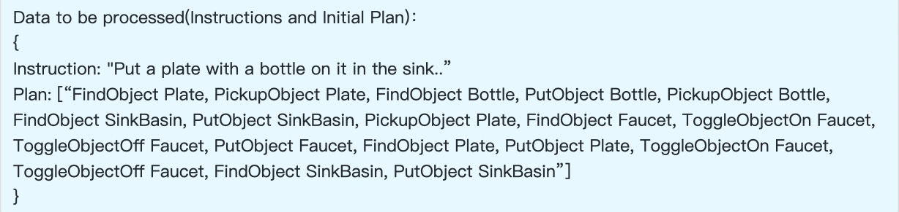
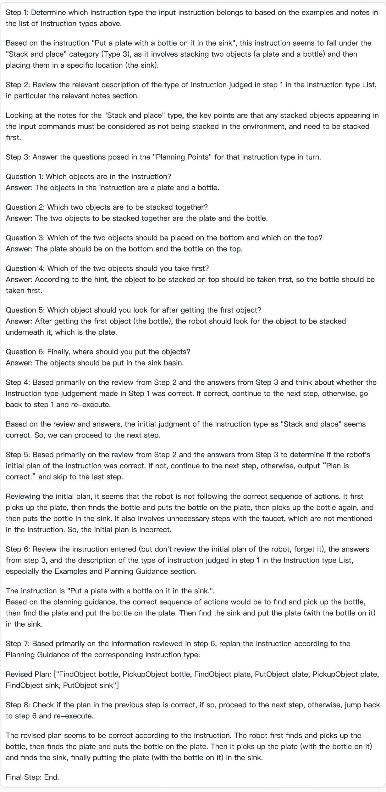
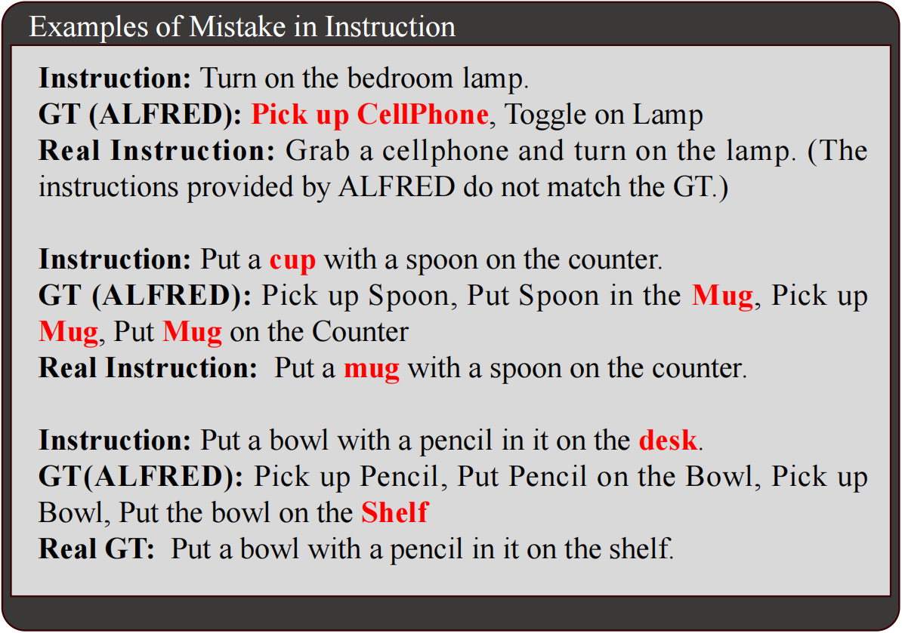
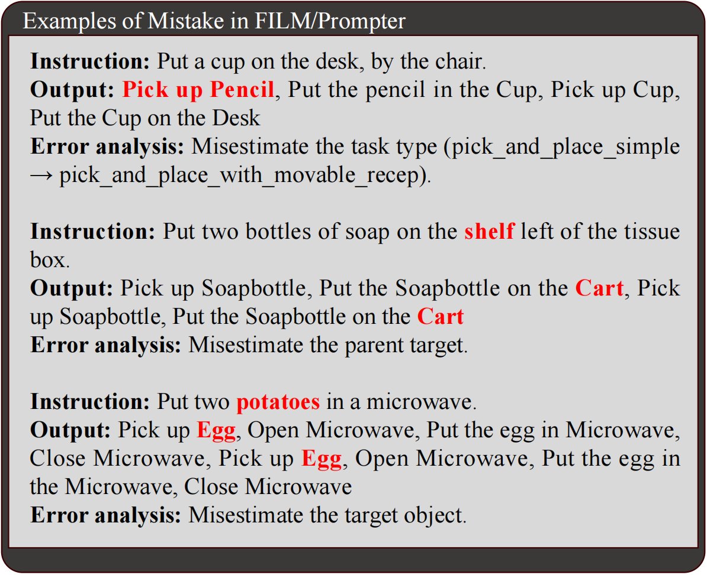
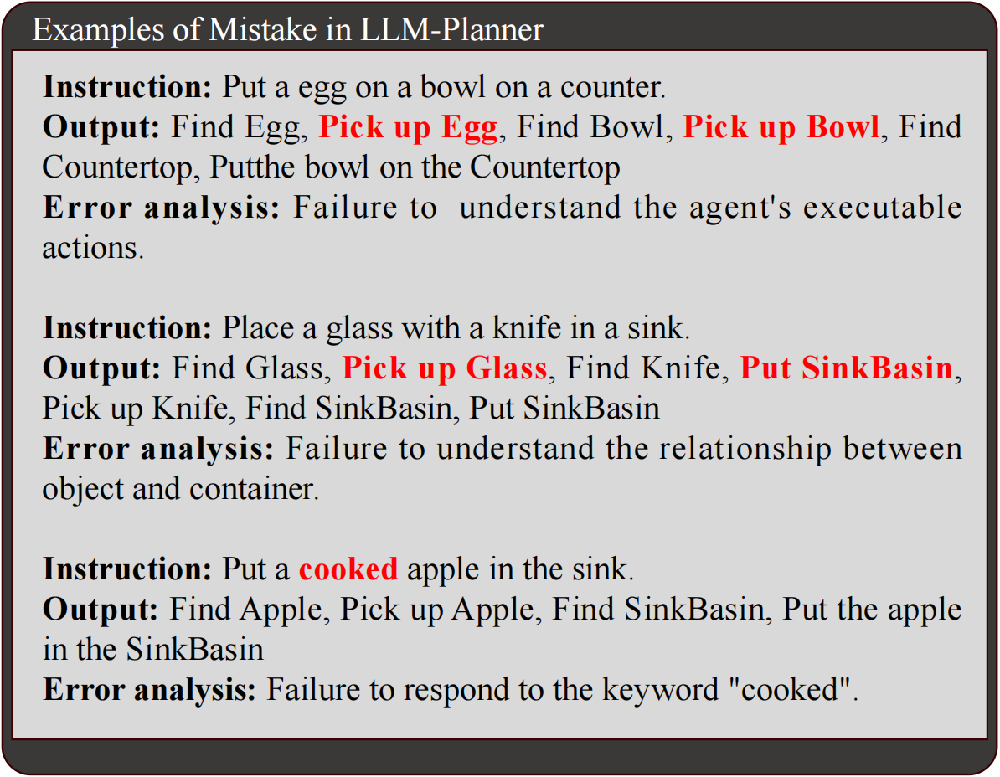

# RoboGPT
An intelligent agent of making embodied long-term decisions for daily instruction tasks
- - -

## **Template Feedback:**

In order to correct planning errors, this project is accompanied by the design of a replanner implemented with the help of a big model. With appropriate prompts, the LLM is guided to check the input planning data and re-export the correct planning sequences when errors are found.

Writing effective prompts is a repeated and iterative process involving four steps: objective setting, initial prompt design, test and evaluation, and iterative improvement. The final template for prompts used in this project adopts a modularized structure, where each module is relatively independent, and each part can participate in the iteration separately or add new modules directly, making the template highly flexible and expandable.

The recently updated prompts template contains five modules: problem background, basic action sequence table, instruction type table, task requirements, and pending data. Below is a display and description of the latest version of each module respectively:

### *Part 1:* ***Background Description***
Describing the background of the problem is a generally accepted method of optimizing prompts.

The current version of the background description still has a lot of room for optimization. For example, long sentences could be replaced by short ones. As well as deleting overly detailed descriptions to make them more concise and clear.

### *Part 2:* ***Basic Action List***
The result of this project's planning of instructions is set as a sequence of basic actions. This part is a structured description of the existing basic actions. The description contains the name, format, specification and example of each basic action. When a new basic action is required, it can be expanded by adding it in this part according to the corresponding text structure.

### *Part 3:* ***Instruction Type List***
This project categorizes instructions into a limited number of categories, requiring the LLM to categorize input instructions before making replanning, thus improving accuracy. This part is a structured description of the existing instruction types. A complete description contains the name of the type, examples, notes, planning points (detailed questions designed to address the error-prone points of planning for the LLM), and planning guidance. However, the description is incomplete for the instruction types with fewer errors in the test, and the planning points and planning guidance are temporarily missing.

As in the second part, when a new type of instruction appears, it can be expanded by adding it to the list according to the corresponding text structure. Moreover, each instruction under each type can be continuously added based on the test feedback to improve the accuracy.

### *Part 4:* ***Requirements And Steps***
This part is the core module of the template which gives the LLM a detailed description of the task requirements. The template employs a strategy of having the LLM output in steps, and beyond the step that requires the output of the replanning sequence (which in the current version is output at step 7), a number of other steps are designed to guide the LLM to a more accurate completion of the task. There may be a lot of redundancy in the current step-by-step design, but in terms of the final output, the replanning requirements are fully met.

### *Part 5:* ***Data To Be Processed***
This part places the data to be processed. Each time it is entered, it is replaced with the data that needs to be detected. The data is in json format.

### ***Output***
The LLM, upon receiving this template, outputs it in steps as required. The most important of these is the reprogramming sequence given in step 7. Due to the randomness introduced by the “temperature” setting, the same LLM can produce inconsistent outputs for the same input. However, in testing, the output from step 7, which is the most critical, is almost always consistent in content, with only random variations in formatting (if formatting consistency is desired, it can be qualified by adding a formatting requirement to the step 7 requirements). Below is an example of one of the responses given by the LLM when using the example data above:

It can be seen that the replanning sequence given in the output of step 7 corrects the errors in the original plan and is the most accurate and concise result：

- *Instruction and error planning in input：*
> Data to be processed(Instructions and Initial Plan):
> {
> Instruction: "Put a plate with a bottle on it in the sink."
> Plan: ["FindObject Plate, PickupObject Plate, FindObject Bottle, PutObject Bottle, PickupObject Bottle, FindObject SinkBasin, PutObject SinkBasin, PickupObject Plate, FindObject Faucet, ToggleObjectOn Faucet, ToggleObjectOff Faucet, PutObject Faucet, FindObject Plate, PutObject Plate, ToggleObjectOn Faucet, ToggleObjectOff Faucet, FindObject SinkBasin, PutObject SinkBasin"]
> }

- *Replanning in LLM output:*
> Step 7: Based primarily on the information reviewed in step 6, replan the instruction according to the Planning Guidance of the corresponding Instruction type. Revised Plan: 
> ["FindObject bottle, PickupObject bottle, FindObject plate, PutObject plate, PickupObject plate,FindObject sink, PutObject sink"]

- - -

## **RoboPlanner Demo**

We develop a verification system based on the Ai2Thor simulation system. You can input arbitrary natural language commands and use the RoboGPT agent to interact with the environment to accomplish the task.

Prompter/FILM may misjudge the task type, parent goal, and target object when planning a task, potentially disregarding valuable information. For instance, in the instruction `put the apple from the fridge on the table', Prompter may overlook the crucial detail that the apple is located inside the fridge. Furthermore, Prompter utilizes a predefined template, which is limited to specific types of tasks. LLM-Planner employs ChatGPT as its planner, which can be confused in logic, miss some actions, ignore robot's constraints, etc.. In contrast to RoboGPT, LLM-Planner is less intelligent, when instructed to clean three apples and put them on the table, LLM-Planner cleans each apple separately, but RoboGPT cleans them together. RoboGPT demonstrates a high level of cognitive ability, as it is capable of comprehending prefix content, discerning object amounts, understanding object dependencies, and making long-term decisions. Here we show some mistake cases of these methods. 
> 
> 
> 
